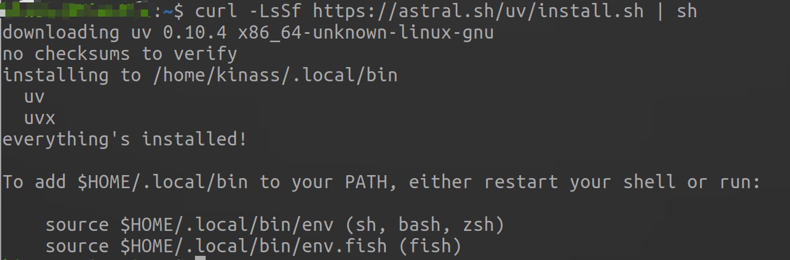
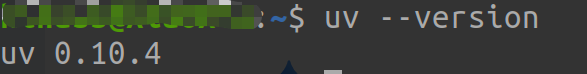

## 1. 安装 uv

在 macOS/Linux 或 Windows (PowerShell) 上运行：

```bash
# macOS/Linux
curl -LsSf https://astral.sh/uv/install.sh | sh

# Windows
powershell -ExecutionPolicy ByPass -c "irm https://astral.sh/uv/install.ps1 | iex"

```


查看是否安装成功
```shell
uv --version
```

## 2. 初始化项目

进入你的代码目录，直接初始化，它会自动帮你下载所需的 Python 版本并创建虚拟环境：

```bash
uv init my-project
cd my-project

```
也可以在创建项目的时候指定python版本
```shell
uv init my_project --python 3.12
```

创建之后会自动生成`pyproject.toml`, `main.py`, `README.md`。
- `pyproject.toml`: 是项目“蓝图”，记录了项目名字、Python 版本和所有源（清华源、PyTorch 源）的配置。
- `mian.py`: 自动生成
- `README.md`: 自动生成的项目介绍

## 3. 安装依赖 (以 PyTorch 为例)

这是 `uv` 最强大的地方，它会自动处理复杂的依赖树：

```bash
# 安装基础深度学习库
uv add torch torchvision torchaudio numpy pandas matplotlib

# 如果你需要特定 CUDA 版本的 Torch (例如 CUDA 12.1)
uv add torch --index-url https://download.pytorch.org/whl/cu121

```
安装好的依赖会在`pyproject.toml`中有依赖项，用于管理依赖清单。

## 4. 运行代码

你不需要手动执行 `source .venv/bin/activate`。`uv` 推荐使用 `run` 命令，它会自动确保在正确的环境下运行：

```bash
uv run train.py

```
## 5. 环境配置
项目需要指定环境的时候可以通过`pyproject.toml`配置。在里面加上这些内容
```
# 1. 主镜像源：用于安装普通的工具库（如 pandas, numpy, tqdm）
# 设置为 default = true，uv 默认会先来这里找，速度最快
[[tool.uv.index]]
name = "tuna"
url = "https://pypi.tuna.tsinghua.edu.cn/simple"
default = true

# 2. PyTorch 专用源：仅用于安装 GPU 版本的 Torch 系列
# 设置为 explicit = true，防止平时装普通库时误入
[[tool.uv.index]]
name = "pytorch-cu121"
url = "https://download.pytorch.org/whl/cu121"
explicit = true

# 3. 如果你有公司内部源或特定的第三方源，可以继续叠加
[[tool.uv.index]]
name = "my-private-repo"
url = "https://my-repo.com/simple"
explicit = true
```
通过Torch官方通道安装依赖
```shell
uv add torch torchvision torchaudio --index pytorch-cu121
```

## 6. 常用命令速查表

| 操作 | 命令 | 说明 |
| --- | --- | --- |
| **安装 Python** | `uv python install 3.10` | 无需手动下载 Python 安装包 |
| **添加依赖** | `uv add <package>` | 自动更新 `pyproject.toml` 并安装 |
| **移除依赖** | `uv remove <package>` | 干净卸载 |
| **锁定环境** | `uv lock` | 生成 `uv.lock` 确保团队环境完全一致 |
| **同步环境** | `uv sync` | 根据 lock 文件一键对齐本地环境 |
| **临时运行** | `uvx tensorboard` | 不安装直接运行工具（类似 npx） |
